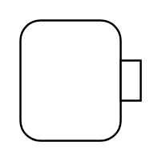

# Action with output

## Definition

```
{
  _style: 'shape=mxgraph.uml25.action;html=1;align=center;verticalAlign=middle;absoluteArcSize=1;arcSize=10;dashed=0;spacingRight=10;whiteSpace=wrap;',
  _width: 0,
  _height: 60,
}
```

## Usage

```
import { ActionWithOutput } from '@reactiac/standard-components-diagrams/uml25'

<ActionWithOutput/>
```

## Preview


