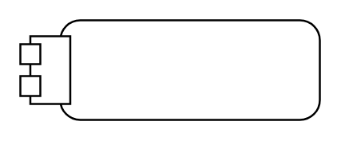

# Action with Parameters

## Definition

```
{
  _style: { 
    entity: 'shape=mxgraph.uml25.actionParams;html=1;align=center;verticalAlign=top;absoluteArcSize=1;arcSize=10;dashed=0;spacingLeft=10;spacingTop=5;whiteSpace=wrap;',
  },
  _original_width: 150,
  _original_height: 50,
}
```

## Usage

```
import { ActionWithParameters } from '@dinghy/standard-components-diagrams/uml25'

<ActionWithParameters/>
```

## Preview


