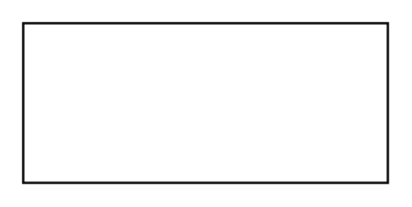

# Actor 2

## Definition

```
{
  _style: { 
    entity: 'html=1;align=center;verticalAlign=middle;dashed=0;whiteSpace=wrap;',
  },
  _original_width: 160,
  _original_height: 70,
}
```

## Usage

```
import { Actor2 } from '@dinghy/standard-components-diagrams/uml25'

<Actor2/>
```

## Preview


