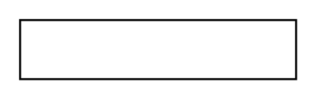

# Association

## Definition

```
{
  _style: 'fontStyle=1;whiteSpace=wrap;html=1;',
  _width: 140,
  _height: 30,
}
```

## Usage

```
import { Association } from '@reactiac/standard-components-diagrams/uml25'

<Association/>
```

## Preview


