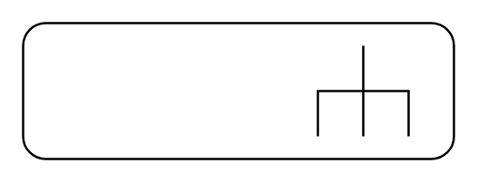

# Behavior Action

## Definition

```
{
  _style: { 
    entity: 'shape=mxgraph.uml25.behaviorAction;html=1;rounded=1;absoluteArcSize=1;arcSize=10;align=left;spacingLeft=5;whiteSpace=wrap;',
  },
  _original_width: 190,
  _original_height: 60,
}
```

## Usage

```
import { BehaviorAction } from '@diac/standard-components-diagrams/uml25'

<BehaviorAction/>
```

## Preview


