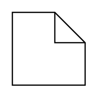

# Behavior

## Definition

```
{
  _style: { 
    entity: 'shape=note2;boundedLbl=1;whiteSpace=wrap;html=1;size=25;verticalAlign=top;align=left;spacingLeft=5;',
  },
  _original_width: 0,
  _original_height: 60,
}
```

## Usage

```
import { Behavior } from '@diac/standard-components-diagrams/uml25'

<Behavior/>
```

## Preview


