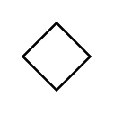

# Choice / Merge Node / Decision Node

## Definition

```
{
  _style: { 
    entity: 'rhombus;',
  },
  _original_width: 30,
  _original_height: 30,
}
```

## Usage

```
import { ChoiceMergeNodeDecisionNode } from '@diac/standard-components-diagrams/uml25'

<ChoiceMergeNodeDecisionNode/>
```

## Preview


