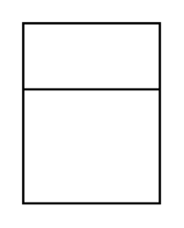

# Class

## Definition

```
{
  _style: { 
    entity: 'swimlane;fontStyle=1;align=center;verticalAlign=middle;childLayout=stackLayout;horizontal=1;startSize=29;horizontalStack=0;resizeParent=1;resizeParentMax=0;resizeLast=0;collapsible=0;marginBottom=0;html=1;whiteSpace=wrap;',
  },
  _width: 0,
  _height: 79,
}
```

## Usage

```
import { Class } from '@diac/standard-components-diagrams/uml25'

<Class/>
```

## Preview


