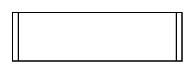

# Classifier 2

## Definition

```
{
  _style: { 
    entity: 'shape=process2;fixedSize=1;size=5;fontStyle=1;html=1;whiteSpace=wrap;',
  },
  _width: 140,
  _height: 40,
}
```

## Usage

```
import { Classifier2 } from '@diac/standard-components-diagrams/uml25'

<Classifier2/>
```

## Preview


