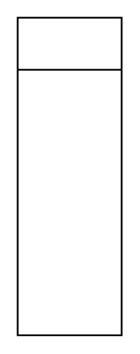

# Classifier 3

## Definition

```
{
  _style: 'swimlane;fontStyle=1;align=center;verticalAlign=top;childLayout=stackLayout;horizontal=1;startSize=30;horizontalStack=0;resizeParent=1;resizeParentMax=0;resizeLast=0;collapsible=0;marginBottom=0;html=1;whiteSpace=wrap;',
  _width: 0,
  _height: 183,
}
```

## Usage

```
import { Classifier3 } from '@diac/standard-components-diagrams/uml25'

<Classifier3/>
```

## Preview


