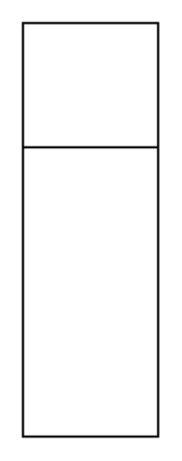

# Classifier

## Definition

```
{
  _style: { 
    entity: 'swimlane;fontStyle=0;align=center;verticalAlign=top;childLayout=stackLayout;horizontal=1;startSize=55;horizontalStack=0;resizeParent=1;resizeParentMax=0;resizeLast=0;collapsible=0;marginBottom=0;html=1;whiteSpace=wrap;',
  },
  _original_width: 0,
  _original_height: 183,
}
```

## Usage

```
import { Classifier } from '@diac/standard-components-diagrams/uml25'

<Classifier/>
```

## Preview


