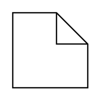

# Constraint / Precondition / Postcondition

## Definition

```
{
  _style: { 
    entity: 'shape=note2;boundedLbl=1;whiteSpace=wrap;html=1;size=25;verticalAlign=top;align=left;spacingLeft=5;whiteSpace=wrap;',
  },
  _original_width: 0,
  _original_height: 60,
}
```

## Usage

```
import { ConstraintPreconditionPostcondition } from '@dinghy/standard-components-diagrams/uml25'

<ConstraintPreconditionPostcondition/>
```

## Preview


