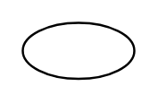

# Icon

## Definition

```
{
  _style: { 
    entity: 'ellipse;html=1;whiteSpace=wrap;',
  },
  _original_width: 50,
  _original_height: 25,
}
```

## Usage

```
import { Icon } from '@dinghy/standard-components-diagrams/uml25'

<Icon/>
```

## Preview


