# Uml UML 2.5 Entities

- [AcceptEventAction](./accept-event-action.md)  
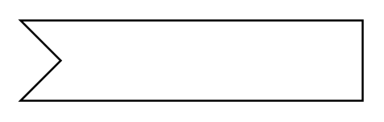

- [ActionWithInput](./action-with-input.md)  

- [ActionWithOutput](./action-with-output.md)  

- [ActionWithOutput2](./action-with-output-2.md)  

- [ActionWithParameters](./action-with-parameters.md)  

- [ActivityPartition](./activity-partition.md)  

- [Actor](./actor.md)  
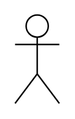

- [Actor2](./actor-2.md)  

- [Association](./association.md)  

- [AssociationInstanceSecification](./association-instance-secification.md)  
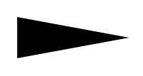

- [AssociationInstanceSecification2](./association-instance-secification-2.md)  

- [Behavior](./behavior.md)  

- [BehaviorAction](./behavior-action.md)  

- [ChoiceMergeNodeDecisionNode](./choice-merge-node-decision-node.md)  

- [Class](./class.md)  

- [Classifier](./classifier.md)  

- [Classifier2](./classifier-2.md)  

- [Classifier3](./classifier-3.md)  

- [Classifier4](./classifier-4.md)  
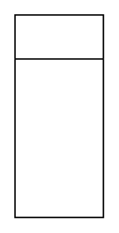

- [Classifier5](./classifier-5.md)  

- [Comment](./comment.md)  
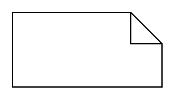

- [Component](./component.md)  
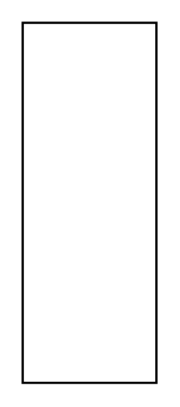

- [ConstraintPreconditionPostcondition](./constraint-precondition-postcondition.md)  

- [Deployment](./deployment.md)  
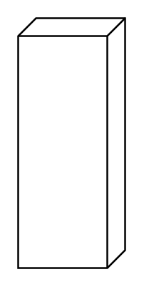

- [EntryPoint](./entry-point.md)  

- [ExecutionRegion](./execution-region.md)  
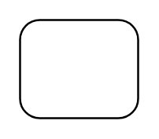

- [ExitPointFlowFinalNode](./exit-point-flow-final-node.md)  
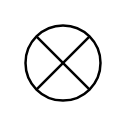

- [Expansion](./expansion.md)  

- [FinalStateNode](./final-state-node.md)  

- [Icon](./icon.md)  

- [InformationItem](./information-item.md)  
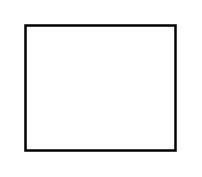

- [InitialPreudostateNode](./initial-preudostate-node.md)  

- [InputPin](./input-pin.md)  

- [InputPin2](./input-pin-2.md)  

- [Instance](./instance.md)  

- [InterruptibleActivityRegion](./interruptible-activity-region.md)  

- [JoinNode](./join-node.md)  

- [JoinForkNode](./join-fork-node.md)  

- [Lifeline](./lifeline.md)  

- [LifelineContinuation](./lifeline-continuation.md)  

- [Model](./model.md)  
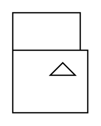

- [ObjectNode](./object-node.md)  

- [ObjectNode2](./object-node-2.md)  

- [OpaqueAction](./opaque-action.md)  

- [OutputPin](./output-pin.md)  

- [OutputPin2](./output-pin-2.md)  

- [Package](./package.md)  

- [Parameter](./parameter.md)  

- [Parameter2](./parameter-2.md)  

- [Parameter3](./parameter-3.md)  

- [Pin](./pin.md)  

- [Port](./port.md)  

- [Port2](./port-2.md)  

- [Property](./property.md)  

- [Property2](./property-2.md)  

- [Region](./region.md)  

- [Region2](./region-2.md)  

- [Region3](./region-3.md)  

- [SendSignalAction](./send-signal-action.md)  

- [ShallowHistory](./shallow-history.md)  
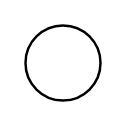

- [SingleExecution](./single-execution.md)  

- [State](./state.md)  
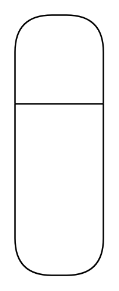

- [State2](./state-2.md)  

- [State3](./state-3.md)  
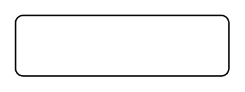

- [State4](./state-4.md)  

- [State5](./state-5.md)  

- [State6](./state-6.md)  

- [StateWithEntryPoint](./state-with-entry-point.md)  
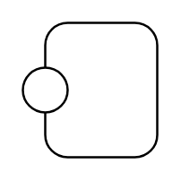

- [StateWithExitPoint](./state-with-exit-point.md)  

- [StereotypeLabel](./stereotype-label.md)  

- [StructuredActivityNode](./structured-activity-node.md)  

- [TemplateSignature](./template-signature.md)  

- [Terminate](./terminate.md)  
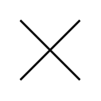

- [TimeEventTrigger](./time-event-trigger.md)  

- [Trigger](./trigger.md)  
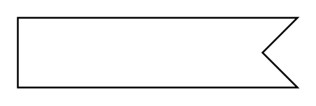

- [UseCase](./use-case.md)  
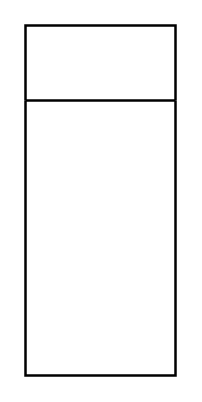
