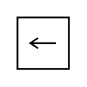

# Input Pin

## Definition

```
{
  _style: { 
    entity: 'shape=mxgraph.uml25.inputPin;html=1;points=[[0,0.5],[1,0.5]];',
  },
  _original_width: 30,
  _original_height: 30,
}
```

## Usage

```
import { InputPin } from '@dinghy/standard-components-diagrams/uml25'

<InputPin/>
```

## Preview


