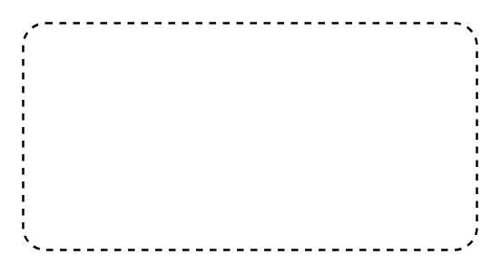

# Interruptible Activity Region

## Definition

```
{
  _style: 'html=1;align=center;verticalAlign=top;rounded=1;absoluteArcSize=1;arcSize=20;dashed=1;whiteSpace=wrap;',
  _width: 200,
  _height: 100,
}
```

## Usage

```
import { InterruptibleActivityRegion } from '@reactiac/standard-components-diagrams/uml25'

<InterruptibleActivityRegion/>
```

## Preview


