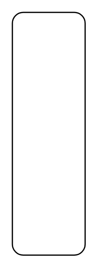

# Lifeline Continuation

## Definition

```
{
  _style: { 
    entity: 'rounded=1;dashed=0;whiteSpace=wrap;html=1;',
  },
  _original_width: 0,
  _original_height: 200,
}
```

## Usage

```
import { LifelineContinuation } from '@dinghy/standard-components-diagrams/uml25'

<LifelineContinuation/>
```

## Preview


