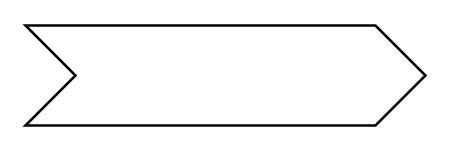

# Object Node 2

## Definition

```
{
  _style: { 
    entity: 'html=1;shape=mxgraph.infographic.ribbonSimple;notch1=20;notch2=20;align=center;verticalAlign=middle;fontSize=14;fontStyle=0;fillColor=#FFFFFF;whiteSpace=wrap;',
  },
  _original_width: 160,
  _original_height: 40,
}
```

## Usage

```
import { ObjectNode2 } from '@diac/standard-components-diagrams/uml25'

<ObjectNode2/>
```

## Preview


