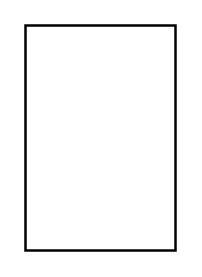

# Object Node

## Definition

```
{
  _style: 'html=1;align=center;verticalAlign=middle;rounded=0;absoluteArcSize=1;arcSize=10;dashed=0;whiteSpace=wrap;',
  _width: 0,
  _height: 90,
}
```

## Usage

```
import { ObjectNode } from '@diac/standard-components-diagrams/uml25'

<ObjectNode/>
```

## Preview


