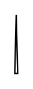

# Parameter 3

## Definition

```
{
  _style: 'triangle;html=1;direction=north;',
  _width: 2,
  _height: 40,
}
```

## Usage

```
import { Parameter3 } from '@diac/standard-components-diagrams/uml25'

<Parameter3/>
```

## Preview


