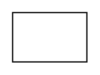

# Parameter

## Definition

```
{
  _style: { 
    entity: 'html=1;',
  },
  _original_width: 0,
  _original_height: 40,
}
```

## Usage

```
import { Parameter } from '@diac/standard-components-diagrams/uml25'

<Parameter/>
```

## Preview


