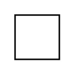

# Port 2

## Definition

```
{
  _style: 'fontStyle=0;labelPosition=right;verticalLabelPosition=middle;align=left;verticalAlign=middle;spacingLeft=2;html=1;',
  _width: 30,
  _height: 30,
}
```

## Usage

```
import { Port2 } from '@reactiac/standard-components-diagrams/uml25'

<Port2/>
```

## Preview


