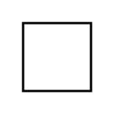

# Port

## Definition

```
{
  _style: { 
    entity: 'fontStyle=0;labelPosition=right;verticalLabelPosition=middle;align=left;verticalAlign=middle;spacingLeft=2;',
  },
  _original_width: 30,
  _original_height: 30,
}
```

## Usage

```
import { Port } from '@dinghy/standard-components-diagrams/uml25'

<Port/>
```

## Preview


