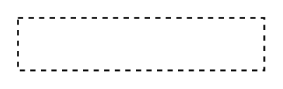

# Property 2

## Definition

```
{
  _style: 'fontStyle=0;dashed=1;html=1;whiteSpace=wrap;',
  _width: 140,
  _height: 30,
}
```

## Usage

```
import { Property2 } from '@reactiac/standard-components-diagrams/uml25'

<Property2/>
```

## Preview


