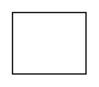

# Property

## Definition

```
{
  _style: { 
    entity: 'align=right;verticalAlign=top;spacingRight=2;whiteSpace=wrap;html=1;',
  },
  _original_width: 0,
  _original_height: 50,
}
```

## Usage

```
import { Property } from '@diac/standard-components-diagrams/uml25'

<Property/>
```

## Preview


