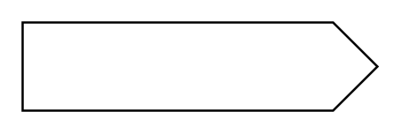

# Send Signal Action

## Definition

```
{
  _style: 'html=1;shape=mxgraph.infographic.ribbonSimple;notch1=0;notch2=20;align=center;verticalAlign=middle;fontSize=14;fontStyle=0;fillColor=#FFFFFF;whiteSpace=wrap;',
  _width: 160,
  _height: 40,
}
```

## Usage

```
import { SendSignalAction } from '@diac/standard-components-diagrams/uml25'

<SendSignalAction/>
```

## Preview


