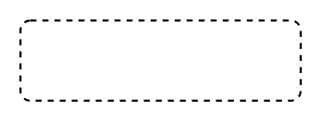

# State 2

## Definition

```
{
  _style: { 
    entity: 'html=1;align=center;verticalAlign=top;rounded=1;absoluteArcSize=1;arcSize=10;dashed=1;whiteSpace=wrap;',
  },
  _original_width: 140,
  _original_height: 40,
}
```

## Usage

```
import { State2 } from '@dinghy/standard-components-diagrams/uml25'

<State2/>
```

## Preview


