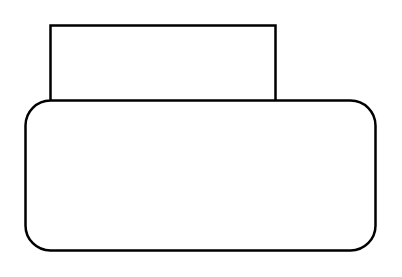

# State 4

## Definition

```
{
  _style: { 
    entity: 'shape=folder;align=center;verticalAlign=middle;fontStyle=0;tabWidth=100;tabHeight=30;tabPosition=left;html=1;boundedLbl=1;labelInHeader=1;rounded=1;absoluteArcSize=1;arcSize=10;whiteSpace=wrap;',
  },
  _width: 140,
  _height: 90,
}
```

## Usage

```
import { State4 } from '@diac/standard-components-diagrams/uml25'

<State4/>
```

## Preview


