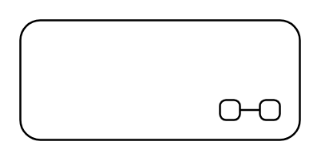

# State 5

## Definition

```
{
  _style: { 
    entity: 'shape=umlState;rounded=1;verticalAlign=top;spacingTop=5;umlStateSymbol=collapseState;absoluteArcSize=1;arcSize=10;html=1;whiteSpace=wrap;',
  },
  _original_width: 140,
  _original_height: 60,
}
```

## Usage

```
import { State5 } from '@dinghy/standard-components-diagrams/uml25'

<State5/>
```

## Preview


