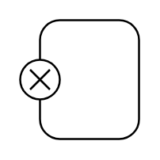

# State with exit point

## Definition

```
{
  _style: 'shape=umlState;rounded=1;verticalAlign=middle;spacingTop=0;absoluteArcSize=1;arcSize=10;umlStateConnection=connPointRefExit;boundedLbl=1;whiteSpace=wrap;html=1;',
  _width: 0,
  _height: 60,
}
```

## Usage

```
import { StateWithExitPoint } from '@diac/standard-components-diagrams/uml25'

<StateWithExitPoint/>
```

## Preview


