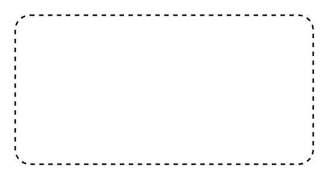

# Structured Activity Node

## Definition

```
{
  _style: { 
    entity: 'dashed=1;rounded=1;absoluteArcSize=1;arcSize=20;html=1;verticalAlign=top;align=left;spacingTop=5;spacingLeft=10;whiteSpace=wrap;',
  },
  _original_width: 200,
  _original_height: 100,
}
```

## Usage

```
import { StructuredActivityNode } from '@diac/standard-components-diagrams/uml25'

<StructuredActivityNode/>
```

## Preview


