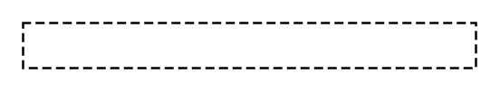

# Template signature

## Definition

```
{
  _style: 'shape=partialRectangle;html=1;top=1;align=left;dashed=1;',
  _width: 200,
  _height: 20,
}
```

## Usage

```
import { TemplateSignature } from '@diac/standard-components-diagrams/uml25'

<TemplateSignature/>
```

## Preview


