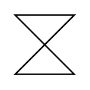

# Time Event Trigger

## Definition

```
{
  _style: { 
    entity: 'shape=collate;html=1;',
  },
  _width: 40,
  _height: 40,
}
```

## Usage

```
import { TimeEventTrigger } from '@diac/standard-components-diagrams/uml25'

<TimeEventTrigger/>
```

## Preview


