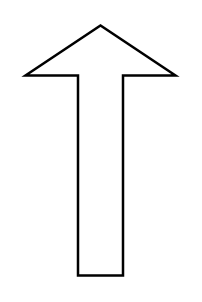

# Arrow Up

## Definition

```
{
  _style: 'shape=singleArrow;direction=north;whiteSpace=wrap;html=1;',
  _width: 60,
  _height: 100,
}
```

## Usage

```
import { ArrowUp } from '@diac/standard-components-diagrams/advanced'

<ArrowUp/>
```

## Preview


