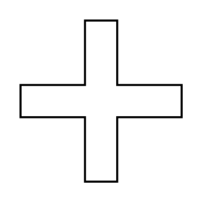

# Cross

## Definition

```
{
  _style: 'shape=cross;whiteSpace=wrap;html=1;',
  _width: 60,
  _height: 60,
}
```

## Usage

```
import { Cross } from '@diac/standard-components-diagrams/advanced'

<Cross/>
```

## Preview


