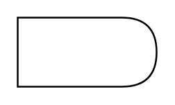

# Delay

## Definition

```
{
  _style: 'shape=delay;whiteSpace=wrap;html=1;',
  _width: 80,
  _height: 40,
}
```

## Usage

```
import { Delay } from '@diac/standard-components-diagrams/advanced'

<Delay/>
```

## Preview


