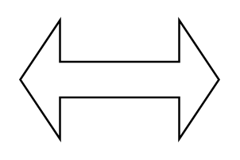

# Double Arrow

## Definition

```
{
  _style: { 
    entity: 'shape=doubleArrow;whiteSpace=wrap;html=1;',
  },
  _original_width: 100,
  _original_height: 60,
}
```

## Usage

```
import { DoubleArrow } from '@diac/standard-components-diagrams/advanced'

<DoubleArrow/>
```

## Preview


