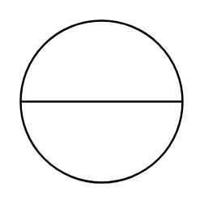

# Ellipse with horizontal divider

## Definition

```
{
  _style: { 
    entity: 'shape=lineEllipse;perimeter=ellipsePerimeter;whiteSpace=wrap;html=1;backgroundOutline=1;',
  },
  _width: 60,
  _height: 60,
}
```

## Usage

```
import { EllipseWithHorizontalDivider } from '@diac/standard-components-diagrams/advanced'

<EllipseWithHorizontalDivider/>
```

## Preview


