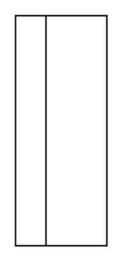

# Horizontal Flow Layout

## Definition

```
{
  _style: { 
    entity: 'swimlane;html=1;startSize=20;horizontal=0;childLayout=flowLayout;flowOrientation=west;resizable=0;interRankCellSpacing=50;containerType=tree;fontSize=12;',
  },
  _width: 0,
  _height: 150,
}
```

## Usage

```
import { HorizontalFlowLayout } from '@diac/standard-components-diagrams/advanced'

<HorizontalFlowLayout/>
```

## Preview


