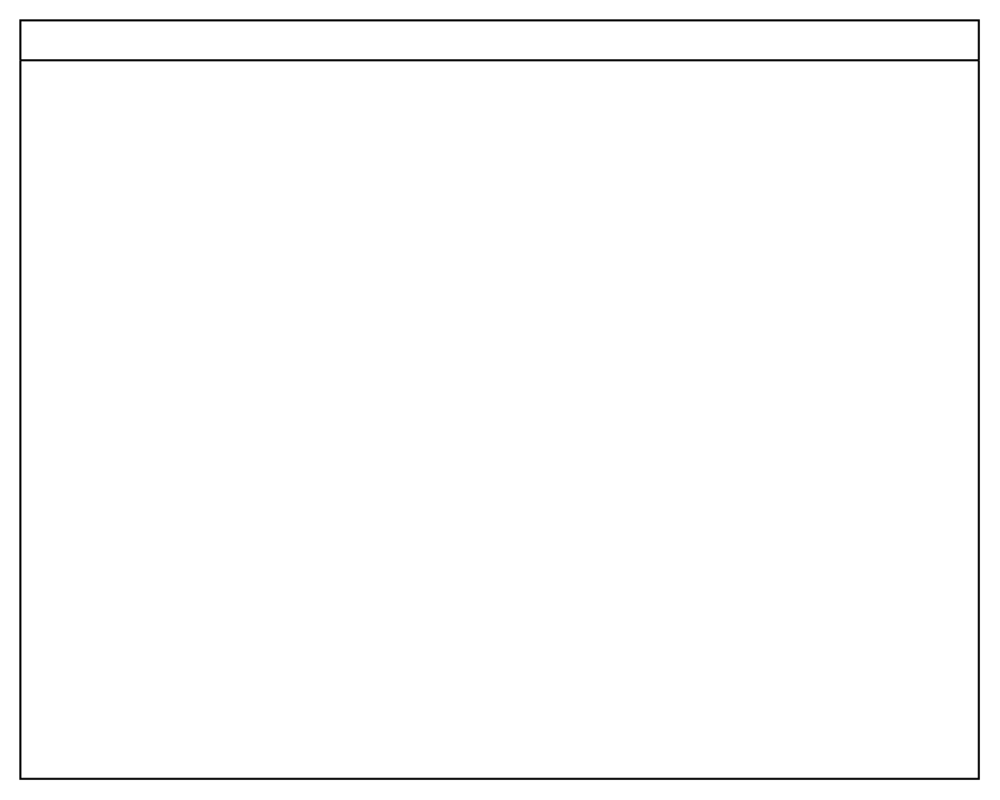

# Horizontal Pool 1

## Definition

```
{
  _style: { 
    entity: 'swimlane;childLayout=stackLayout;resizeParent=1;resizeParentMax=0;horizontal=1;startSize=20;horizontalStack=0;html=1;',
  },
  _original_width: 480,
  _original_height: 380,
}
```

## Usage

```
import { HorizontalPool1 } from '@diac/standard-components-diagrams/advanced'

<HorizontalPool1/>
```

## Preview


