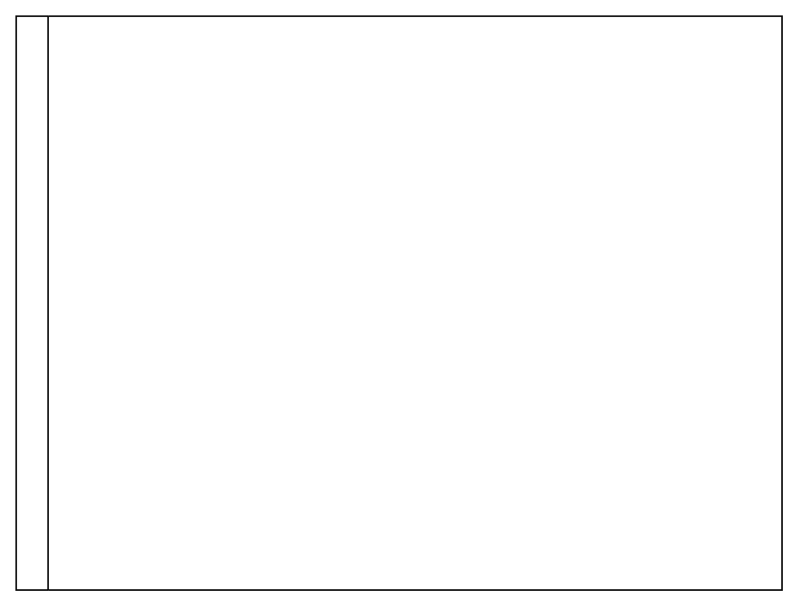

# Horizontal Pool 2

## Definition

```
{
  _style: 'swimlane;childLayout=stackLayout;resizeParent=1;resizeParentMax=0;horizontal=0;startSize=20;horizontalStack=0;html=1;',
  _width: 480,
  _height: 360,
}
```

## Usage

```
import { HorizontalPool2 } from '@reactiac/standard-components-diagrams/advanced'

<HorizontalPool2/>
```

## Preview


