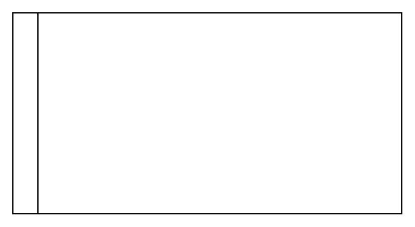

# Horizontal Tree Layout

## Definition

```
{
  _style: 'swimlane;startSize=20;horizontal=0;childLayout=treeLayout;horizontalTree=1;sortEdges=1;resizable=0;containerType=tree;fontSize=12;',
  _width: 310,
  _height: 160,
}
```

## Usage

```
import { HorizontalTreeLayout } from '@reactiac/standard-components-diagrams/advanced'

<HorizontalTreeLayout/>
```

## Preview


