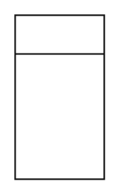

# List

## Definition

```
{
  _style: 'swimlane;fontStyle=0;childLayout=stackLayout;horizontal=1;startSize=26;fillColor=none;horizontalStack=0;resizeParent=1;resizeParentMax=0;resizeLast=0;collapsible=1;marginBottom=0;html=1;',
  _width: 0,
  _height: 110,
}
```

## Usage

```
import { List } from '@diac/standard-components-diagrams/advanced'

<List/>
```

## Preview


