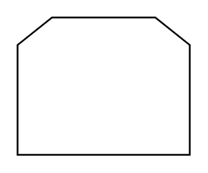

# Loop Limit

## Definition

```
{
  _style: 'shape=loopLimit;whiteSpace=wrap;html=1;',
  _width: 100,
  _height: 80,
}
```

## Usage

```
import { LoopLimit } from '@reactiac/standard-components-diagrams/advanced'

<LoopLimit/>
```

## Preview


