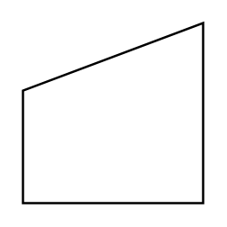

# Manual Input

## Definition

```
{
  _style: { 
    entity: 'shape=manualInput;whiteSpace=wrap;html=1;',
  },
  _original_width: 80,
  _original_height: 80,
}
```

## Usage

```
import { ManualInput } from '@dinghy/standard-components-diagrams/advanced'

<ManualInput/>
```

## Preview


