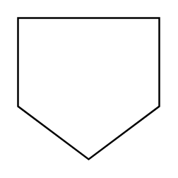

# Off Page Connector

## Definition

```
{
  _style: 'shape=offPageConnector;whiteSpace=wrap;html=1;',
  _width: 60,
  _height: 60,
}
```

## Usage

```
import { OffPageConnector } from '@diac/standard-components-diagrams/advanced'

<OffPageConnector/>
```

## Preview


