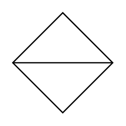

# Sort

## Definition

```
{
  _style: 'shape=sortShape;perimeter=rhombusPerimeter;whiteSpace=wrap;html=1;',
  _width: 60,
  _height: 60,
}
```

## Usage

```
import { Sort } from '@diac/standard-components-diagrams/advanced'

<Sort/>
```

## Preview


