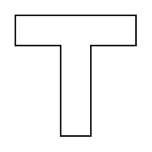

# Tee

## Definition

```
{
  _style: 'shape=tee;whiteSpace=wrap;html=1;',
  _width: 80,
  _height: 80,
}
```

## Usage

```
import { Tee } from '@reactiac/standard-components-diagrams/advanced'

<Tee/>
```

## Preview


