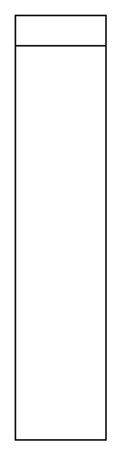

# Vertical Flow Layout

## Definition

```
{
  _style: { 
    entity: 'swimlane;startSize=20;horizontal=1;childLayout=flowLayout;flowOrientation=north;resizable=0;interRankCellSpacing=50;containerType=tree;fontSize=12;',
  },
  _original_width: 0,
  _original_height: 280,
}
```

## Usage

```
import { VerticalFlowLayout } from '@diac/standard-components-diagrams/advanced'

<VerticalFlowLayout/>
```

## Preview


