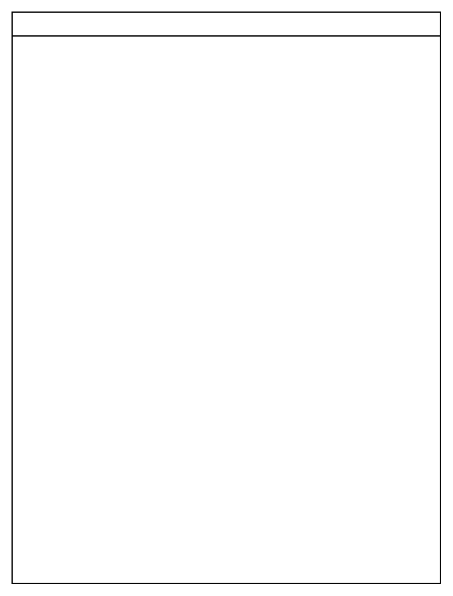

# Vertical Pool 1

## Definition

```
{
  _style: { 
    entity: 'swimlane;childLayout=stackLayout;resizeParent=1;resizeParentMax=0;startSize=20;html=1;',
  },
  _original_width: 360,
  _original_height: 480,
}
```

## Usage

```
import { VerticalPool1 } from '@dinghy/standard-components-diagrams/advanced'

<VerticalPool1/>
```

## Preview


